# Health Tracking App

## 📖 About the Project
The **Health Tracking App** is a full-stack application designed to help users monitor and manage their daily health metrics effectively. This application offers modular functionalities such as water intake tracking, step counting, sleep analysis, and much more. Built with modern technologies, it combines secure backend architecture with an interactive and responsive frontend.

---

## ✨ Features

### 🔑 Authentication
- **JWT-based Authentication**: Secure login and registration system.
- **Password Reset**: Email-based password reset functionality.

### 💧 Water Intake Module
- Track daily water consumption.
- Set and monitor daily water intake goals.
- Visualize progress with interactive charts.

### 🚶‍♂️ Step Counter Module
- Log daily steps and set goals.
- Analyze step data using bar and pie charts.
- Calculate goal achievement rates.

### ❤️ Heart Rate & Sleep Module
- Record and analyze heart rate data.
- Monitor sleep duration and compare with daily targets.
- Generate personalized summaries.

### 📏 Height & Weight Module
- Record height and weight data.
- Calculate and categorize BMI (Body Mass Index).
- Provide ideal weight range based on BMI analysis.

### 🍎 Calorie Tracking Module
- Log daily calorie intake and set goals.
- Analyze calorie consumption with detailed summaries.
- Track progress across weekly, monthly, and yearly timeframes.

### 💤 Sleep Module
- Record and track sleep durations.
- Compare actual sleep durations with daily targets.
- Visualize sleep data with interactive graphs.

### 📊 Real-Time Data Visualization
- Dynamic and interactive graphs for better insights.
- Summary statistics for weekly, monthly, and yearly progress.

### 📱 Responsive Design
- Optimized for all devices, ensuring seamless usability.

---

## 🛠️ Technologies Used

### Backend
- **Spring Boot**: Framework for backend services.
- **PostgreSQL**: Robust database management.
- **Spring Security**: Secure authentication and authorization.
- **Lombok**: Simplifies Java object management.
- **Maven**: Dependency management.

### Frontend
- **React**: Modern frontend library for building user interfaces.
- **React Bootstrap**: For responsive and visually appealing components.

### Tools
- **Postman**: API testing.
- **DBeaver**: Database management.
- **JWT**: Token-based security.

---

## 🚀 Getting Started

### Prerequisites
- **Java 17+** for the backend.
- **Node.js 16+** for the frontend.
- PostgreSQL installed and configured.

### Installation

#### 1. Clone the Repository
```bash
git clone https://github.com/barisozkn1/Health-Tracking-App.git
```

#### 2. Setup Backend
```bash
cd health-tracking
mvn clean install
mvn spring-boot:run
```

#### 3. Setup Frontend
```bash
cd health-data-frontend
npm install
npm start
```

#### 4. Configure the Database
Ensure the PostgreSQL database is running and configured. Update the database connection details in the `application.properties` file in the backend:
```properties
spring.datasource.url=jdbc:postgresql://localhost:5432/postgres
spring.datasource.username=postgres
spring.datasource.password=12345
spring.jpa.properties.hibernate.default_schema=healthtracking

Note: Replace spring.datasource.username and spring.datasource.password with your PostgreSQL username and password. For example:
- spring.datasource.username should be your PostgreSQL username (e.g., postgres by default).
- spring.datasource.password should be your PostgreSQL password (e.g., 12345 in this example).
```

---

## 📈 Project Structure

```
Health-Tracking-App/
├── backend/
│   ├── src/main/java/com/baris/healthtracking
│   │   ├── config
│   │   ├── controller
│   │   ├── dto
│   │   ├── entites
│   │   ├── enums
│   │   ├── exception
│   │   ├── repository
│   │   ├── security.models
│   │   ├── services
│   │   ├── starter
│   ├── src/main/resources
│   │   └── application.properties
├── frontend/
│   ├── src/
│   │   ├── assets
│   │   ├── components
│   │   ├── context
│   │   ├── pages
│   │   ├── routes
│   │   ├── services
│   │   └── App.js
└── README.md
```

---
## 📊 Visualizations
Here are some screenshots from the application:

### **Login and Registration**
- **Login Page**  
  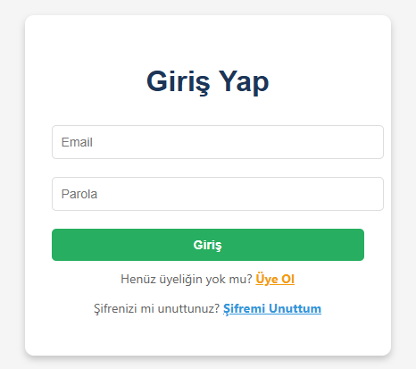  

- **Register Page**  
  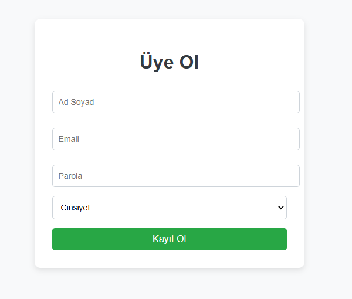  

- **Forget Password Page**  
  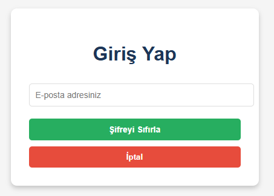  

---

### **Dashboard and Navigation**
- **Dashboard Page**  
  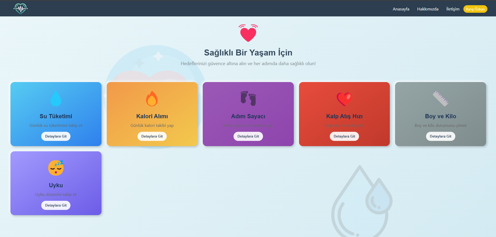  

- **About Page**  
    

- **Contact Page**  
  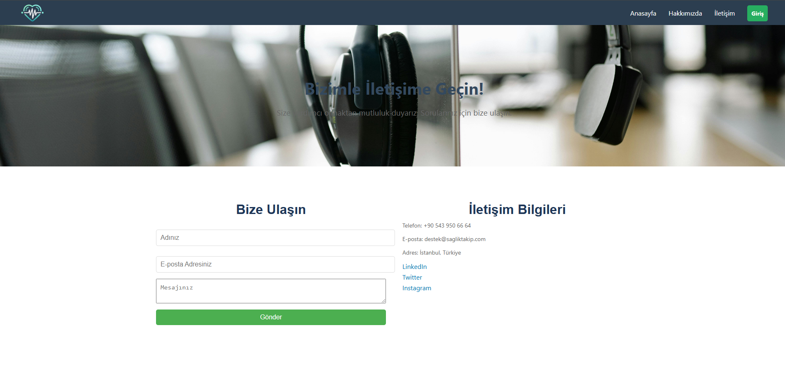  

---

### **Modules and Visualizations**
- **Water Module**  
  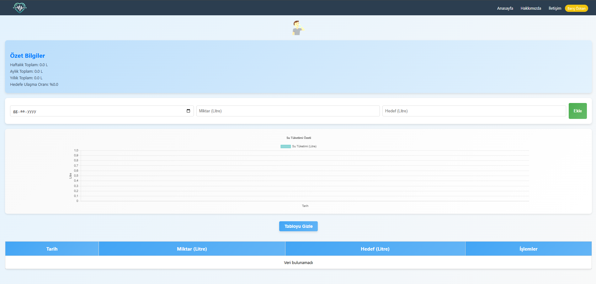  

- **Step Counter Module**  
  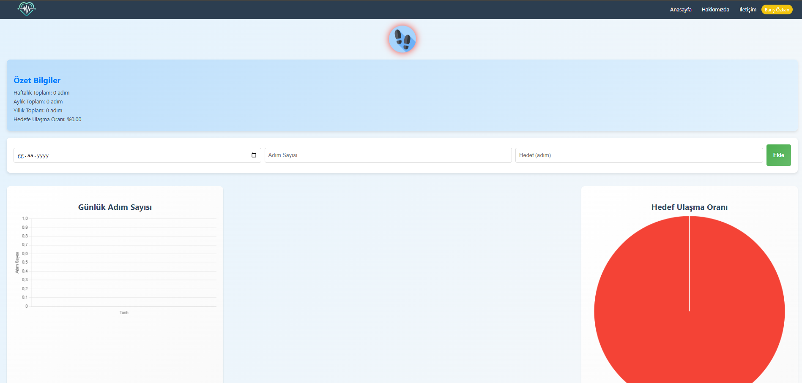  

- **Heart Rate Module**  
  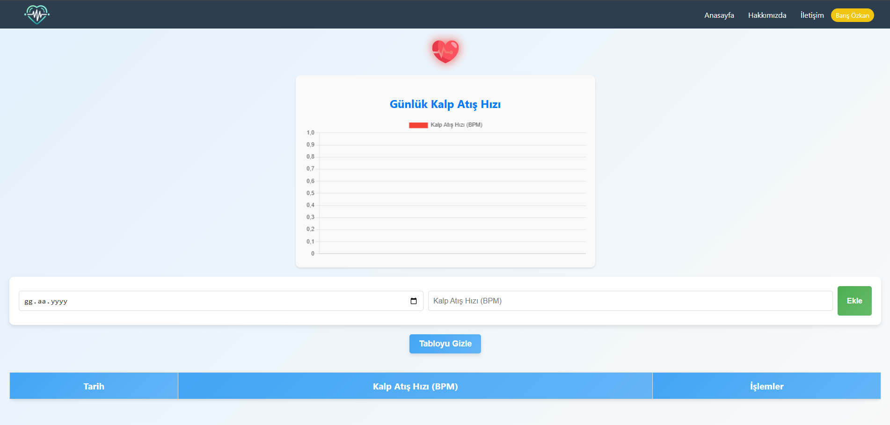  

- **Sleep Module**  
  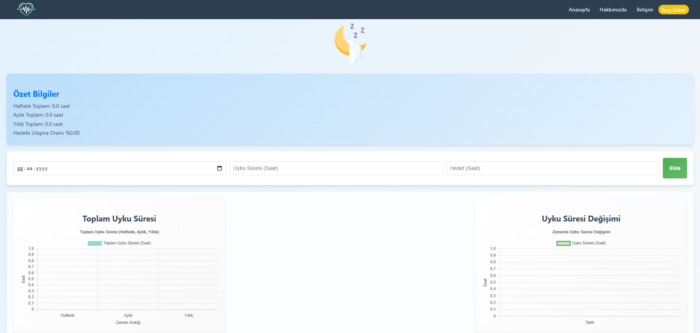  

- **Height and Weight Module**  
  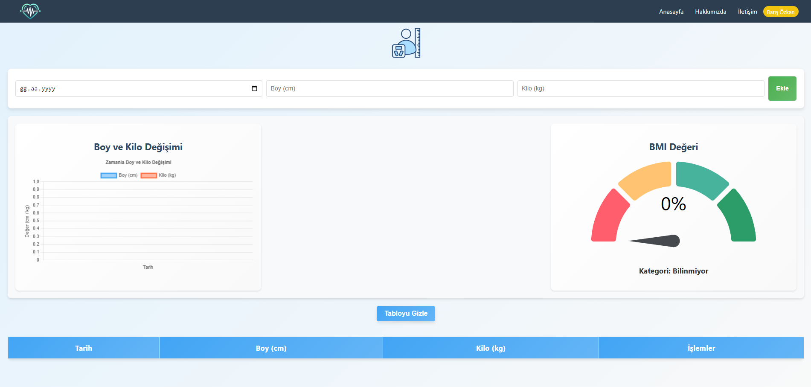  

- **Calorie Module**  
  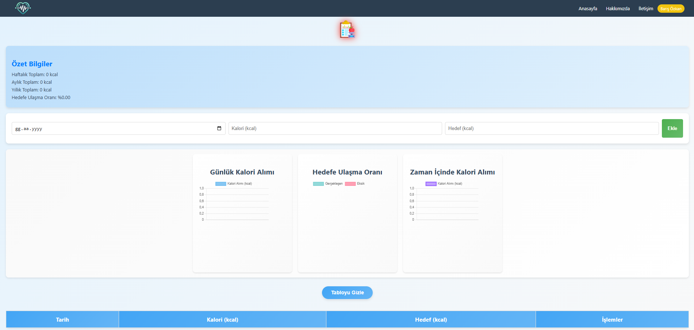  

---

### **User Profile**
- **Profile Page**  
  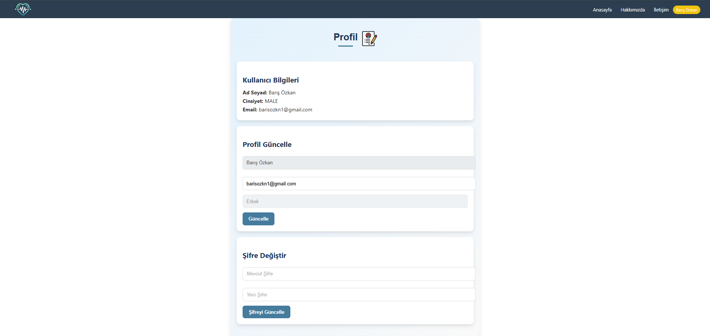  

---


## 🤝 Contributing
Contributions are welcome! Please fork the repository and create a pull request to suggest improvements.

---

## 📩 Contact

**Barış Özkan**  
📧 Email: barisozkn1@gmail.com  

---

